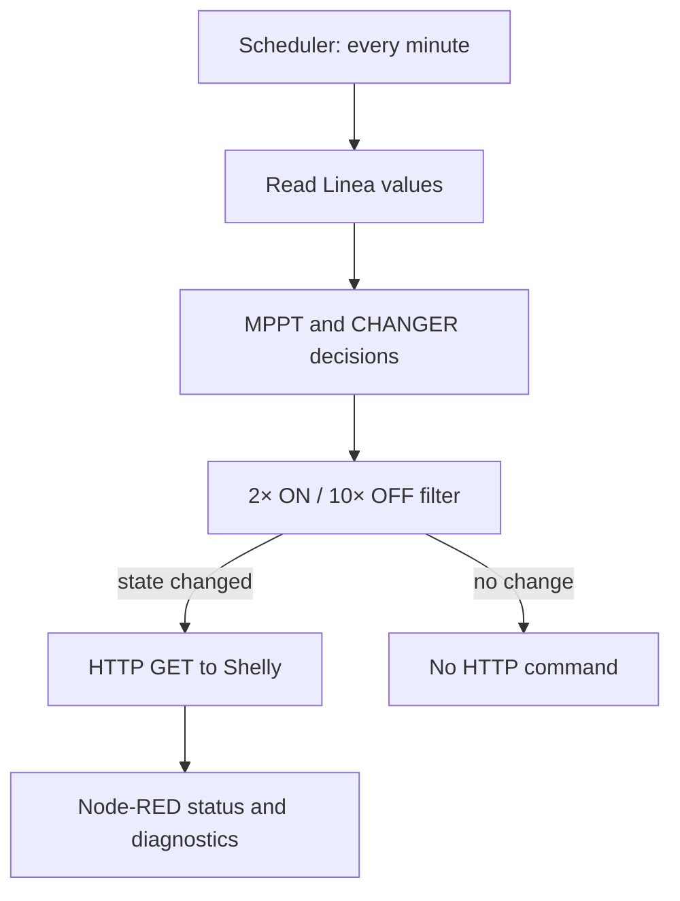

[Česká verze](README_CZ.md) · [Linea project](https://github.com/hacesoft/Linea) · [Original repository](https://github.com/hacesoft/Cooling_Trackers_Rack)

# Cooling Trackers Rack

**Automatic cooling for Victron MPPT controllers and inverter/chargers in a rack, using Node-RED and Shelly devices.**


## What the module does

The flow controls two independent cooling branches:

| Branch | Default device | Turn-on condition |
|---|---|---|
| MPPT | Shelly at `192.168.11.7`, relay 0 | Total PV power `pvPower >= 710 W` |
| CHANGER | Shelly at `192.168.11.9`, relay 0 | The inverter is converting more than 600 W, based on PV and battery power |

Some node names use the historical labels `MPTT` and `CHANGER`. In this guide, MPPT means the solar charge controller and CHANGER means the inverter/charger.

Every minute, the flow evaluates power data, applies a consecutive-sample delay, and sends an HTTP GET request to Shelly only when the requested state changes. It also includes direct manual ON/OFF controls, node status displays and HTTP error capture.

## Important safety notice

This is supplementary cooling, not a device safety system. Do not use it as a replacement for manufacturer-provided thermal protection, correct electrical sizing, circuit protection, enclosure ventilation or qualified electrical work.

- Verify the fan load and relay rating.
- Keep Shelly and Node-RED on a trusted local network. The default flow uses unencrypted HTTP without authentication.
- Before production use, test manual STOP, network loss, a Node-RED restart and loss of Victron data.
- When changing IP addresses, update every location listed under Configuration.

## Control flow



### MPPT cooling

The `MPTT` node uses the global `pvPower` value:

- ON request: `pvPower >= 710 W`;
- OFF request: `pvPower < 710 W`;
- `_general_stop === true` also requests OFF.

The actual threshold is the `n_trigger_MPTT` value in executable code. An older comment inside the function still says 900 W, but the code uses **710 W**.

### Inverter cooling

The `CHANGER` node uses `pvPower`, battery power `nBattery_Power`, and a shared 600 W threshold. After conversion from a raw unsigned 16-bit value:

- positive battery power means charging;
- negative battery power means discharging.

Cooling is requested when at least one condition is true:

1. battery discharge exceeds 600 W: `nBattery_Power < -600`;
2. estimated grid-to-battery conversion exceeds 600 W: `nBattery_Power - pvPower > 600`;
3. estimated PV surplus converted to AC exceeds 600 W: `pvPower - nBattery_Power > 600`.

Otherwise, the flow requests OFF. The intention is to avoid cooling the inverter while idle or while PV is charging the battery directly without significant inverter conversion.

### Consecutive-sample delay and actual timing

Both branches use the same filter:

| Transition | Consecutive evaluations | Approximate time with the default schedule |
|---|---:|---:|
| Turn ON | 2 | 2 minutes |
| Turn OFF | 10 | 10 minutes |

An opposite request resets the corresponding counter. A Shelly command is sent only when the internal state changes, not every minute. These times are derived from the one-minute scheduler and change proportionally if its interval changes.

CHANGER evaluation is delayed by 3 seconds relative to MPPT so both HTTP requests are not emitted at the same instant.

### Scheduler

The `START 1 minuta` inject node uses this cron expression:

```text
*/1 4-21 * * *
```

The flow therefore evaluates every minute from 04:00 through 21:59, using the timezone of the system running Node-RED. Outside this window, automatic evaluation stops and the last state remains unchanged. If an evening shutdown must be guaranteed, extend the schedule or add a separate direct STOP.

## Requirements

### Recommended: integration with Linea

- a working Node-RED installation;
- the installed and configured [Linea](https://github.com/hacesoft/Linea) project;
- Victron Energy data available in Linea;
- two Shelly or compatible devices exposing `/relay/0?turn=on|off` over HTTP;
- fans with appropriate voltage and current ratings.

The cooling module itself uses only standard Node-RED nodes (`inject`, `function`, `delay`, `http request`, `catch`, and `debug`). Modbus communication and source-data preparation are supplied by Linea or by your own input flow.

### Values supplied by Linea

| Name | Type | Meaning |
|---|---|---|
| `global.pvPower` | number, W | Current total PV power |
| `global.nBattery_Power` | raw 16-bit value | Battery power from register 842 |
| `global.fSendUrl` | function | Builds the Shelly URL |
| `global.nConvertSignetUnsignet` | function | Converts unsigned 16-bit data to signed |

## Installation with Linea

1. Install and commission [Linea](https://github.com/hacesoft/Linea). Confirm that its global initialization has run and that `pvPower` and `nBattery_Power` are being updated.
2. Download `chlazeni_flows_19092026_1849.json`.
3. In Node-RED, choose **Menu → Import → Clipboard**, paste the complete JSON and import it as a new flow.
4. Configure IP addresses, relay numbers, thresholds and the schedule as described below.
5. Click **Deploy**.
6. Complete the First start checklist before enabling unattended operation.

## Configuration

### 1. Shelly IP addresses and relay numbers

Defaults:

| Purpose | IP | Relay |
|---|---|---:|
| MPPT fan | `192.168.11.7` | 0 |
| Inverter fan | `192.168.11.9` | 0 |

The addresses are hard-coded in several places. Update all of these:

- `MPTT`: the `sIpAddress` variable;
- `CHANGER`: the `sIpAddress` variable;
- `ON_MPTT` and `OFF_MPTT`: direct manual-control URLs;
- `ON_CHANGERs` and `OFF_CHANGERs`: direct manual-control URLs;
- both `Process Response` nodes: IP-to-status-label mapping.

For a relay other than 0, change `nRelayNumber` in the automatic functions and `/relay/0` in all four manual-control functions.

### 2. Power thresholds

In `MPTT`:

```javascript
let n_trigger_MPTT = 710;
```

In `CHANGER`:

```javascript
const n_trigger = 600;
```

Both values are watts. After editing them, verify behavior against live data, especially the battery-power sign convention.

### 3. Consecutive-sample filter

In both `CopyOnChange_URL_m` and `CopyOnChange_URL_ch`:

```javascript
const nWaitLoop = 10;      // evaluations before OFF
const nWaitStartLoop = 2;  // evaluations before ON
```

These are evaluation counts, not minutes.

### 4. Automatic evaluation window

Edit the schedule in `START 1 minuta`. For continuous one-minute operation, use:

```text
*/1 * * * *
```

## First start checklist

1. Assign static IP addresses or DHCP reservations to both Shelly devices.
2. From a computer on the same network, open each URL in turn:

   ```text
   http://192.168.11.7/relay/0?turn=on
   http://192.168.11.7/relay/0?turn=off
   http://192.168.11.9/relay/0?turn=on
   http://192.168.11.9/relay/0?turn=off
   ```

3. Confirm that each command controls the intended fan.
4. In Node-RED, test the manual `Nouzovy START` and `Nouzovy STOP` controls for MPPT and then CHANGER. These branches bypass the consecutive-sample filter.
5. Inspect `global.pvPower` and `global.nBattery_Power` in the context/debug view.
6. Trigger `START 1 minuta` manually or supply controlled test values. Remember that ON requires two consecutive requests and OFF requires ten.
7. Observe status text under `MPTT`, `CHANGER`, both `CopyOnChange...` nodes and `Process Response`.
8. Finally, test a Node-RED restart and an unreachable Shelly device.

## Manual and emergency control

Each branch has `Nouzovy START` and `Nouzovy STOP` buttons. They build direct URLs and feed the HTTP request node, bypassing automatic decisions and the consecutive-sample filter.

`FAN ALL STOP` fires two seconds after deployment, but its current wiring only submits a single `_general_stop=true` request to the automatic branches. The OFF filters require ten consecutive requests, and their internal state may initialize as already off after a restart. Therefore, **this node must not be treated as a guaranteed physical stop for both fans**. For a reliable all-stop operation, use direct OFF branches or modify the flow so both OFF URLs are sent directly to the HTTP request node.

## Standalone use without Linea

The imported flow is not fully standalone because it does not contain a Victron data source. It can be used without Linea when another flow provides the same interface:

1. regularly set `global.pvPower` to total PV power in watts;
2. set `global.nBattery_Power` to the raw unsigned 16-bit battery-power value, or modify `CHANGER` if your source already supplies signed watts;
3. create these global functions at startup:

```javascript
global.set('fSendUrl', function (ipAddress, relayNumber, turn) {
    return `http://${ipAddress}/relay/${relayNumber}?turn=${turn}`;
});

global.set('nConvertSignetUnsignet', function (number) {
    if (number > 32767) number -= 65536;
    return number;
});
```

Place this code in the **On Start** tab of a separate Function node and deploy it before testing the cooling flow. The data source may be Modbus, MQTT, Venus OS or another integration, but it must follow the units and sign conventions above.

## Status and diagnostics

- `MPTT` and `CHANGER` show the decision reason and current request.
- `CopyOnChange_URL_m/ch` show the internal state and counters.
- `Process Response` displays the last successfully requested state for both branches.
- `catch` captures errors from the HTTP request node and sends them to `DEBUG_CHLAZENI`.
- Additional debug nodes are disabled by default or intended for development.

The `Process Response` status confirms a successful HTTP request and derives the requested state from its URL. It is not independent feedback of fan RPM or airflow.

## Troubleshooting

### “Chyba: Globální funkce nenalezeny”

`fSendUrl` or `nConvertSignetUnsignet` is missing. Check Linea startup initialization, deployment order and global context.

### Fans do not start automatically

- confirm that the current time is between 04:00 and 21:59;
- inspect `pvPower` and `nBattery_Power`;
- wait for two consecutive one-minute evaluations;
- check the Shelly IP, relay number and network reachability;
- make sure `_general_stop` is not true in a test message.

### Fans do not stop

The default filter waits for ten consecutive OFF requests. With the default schedule, this is approximately ten minutes. Any intervening ON request resets the OFF counter.

### Status identifies the wrong device or remains unknown

Update the IP mapping in both `Process Response` nodes. Changing only `MPTT` or `CHANGER` may control the correct device while preventing the status node from identifying it.

### HTTP 200 is followed by a response-processing error

`Process Response` calls `JSON.parse(msg.payload)`. A compatible device must therefore return valid JSON. For a device returning text or an empty response, modify this node or add guarded parsing.

### Battery readings are implausible

Confirm that the input really uses the unsigned 16-bit encoding expected from register 842. If the source already returns signed watts, converting it again may produce an incorrect interpretation.

## Known limitations of the current flow

- IP addresses are duplicated across several functions instead of being centrally configured.
- Thresholds, filter lengths and the schedule are hard-coded.
- The deploy-time `FAN ALL STOP` does not guarantee a physical all-stop operation.
- Internal filter state may not match the real relay state after a restart.
- The HTTP response confirms the command, not actual fan operation.
- The default Shelly API is unauthenticated HTTP; application-level timeout/retry behavior is not implemented.
- The flow does not reevaluate state outside the scheduler window.