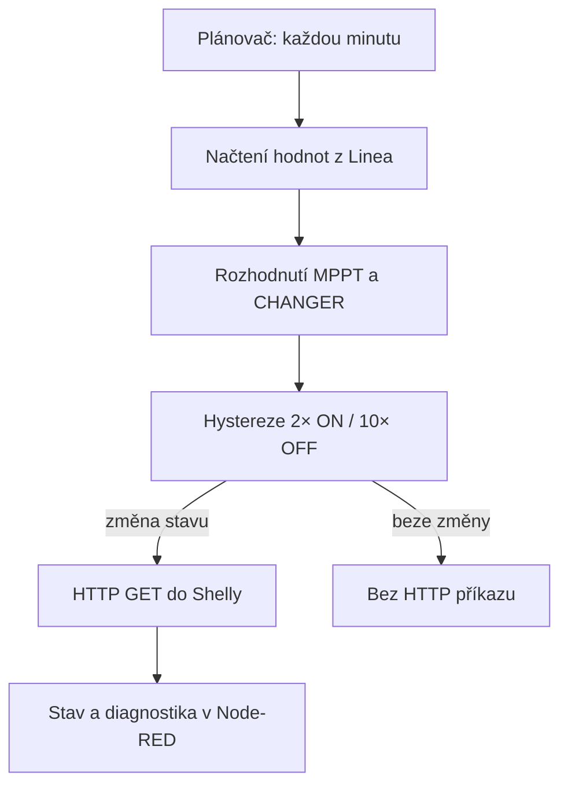

[English version](README.md) · [Projekt Linea](https://github.com/hacesoft/Linea) · [Původní repozitář](https://github.com/hacesoft/Cooling_Trackers_Rack)

# Cooling Trackers Rack

**Automatické chlazení MPPT regulátorů a měničů Victron v racku pomocí Node-RED a Shelly.**


## Co modul dělá

Flow řídí dvě samostatné větve chlazení:

| Větev | Zařízení ve výchozím flow | Podmínka zapnutí |
|---|---|---|
| MPPT | Shelly na `192.168.11.7`, relé 0 | Celkový FV výkon `pvPower >= 710 W` |
| CHANGER | Shelly na `192.168.11.9`, relé 0 | Měnič podle výkonu FV a baterie skutečně převádí více než 600 W |

Názvy některých nodů používají historický zápis `MPTT` a `CHANGER`. V tomto návodu znamená MPPT solární regulátor a CHANGER měnič/nabíječ.

Flow každou minutu vyhodnotí výkon, přes hysterezi rozhodne o změně stavu a při změně odešle do Shelly HTTP GET požadavek. Obsahuje také ruční zapnutí/vypnutí obou větví, zobrazení stavů a zachycení chyby HTTP nodu.

## Důležité bezpečnostní upozornění

Toto je doplňkové chlazení, nikoli bezpečnostní ochrana zařízení. Nepoužívejte je jako náhradu teplotní ochrany výrobce, správného dimenzování, jištění, ventilace rozvaděče nebo odborné elektroinstalace.

- Ověřte příkon ventilátorů a zatížitelnost použitého relé.
- Shelly a Node-RED umístěte do důvěryhodné lokální sítě. Výchozí flow používá nešifrované HTTP bez autentizace.
- Před ostrým provozem otestujte ruční STOP, výpadek sítě, restart Node-RED a ztrátu dat z Victronu.
- Po změně IP adres upravte všechna místa uvedená v části Konfigurace.

## Jak řízení funguje



### Chlazení MPPT

Node `MPTT` používá globální hodnotu `pvPower`:

- zapnutí: `pvPower >= 710 W`;
- vypnutí: `pvPower < 710 W`;
- při `_general_stop === true` požaduje vypnutí.

Práh 710 W je zapsán přímo ve funkci `MPTT` jako `n_trigger_MPTT`. Komentář v této funkci ještě uvádí 900 W, ale vykonávaný kód používá **710 W**.

### Chlazení měničů

Node `CHANGER` používá `pvPower`, výkon baterie `nBattery_Power` a společný práh 600 W. Po převodu 16bitové hodnoty baterie platí:

- kladná hodnota = nabíjení baterie;
- záporná hodnota = vybíjení baterie.

Chlazení se požaduje zapnout, pokud platí alespoň jedna z podmínek:

1. baterie se vybíjí více než 600 W: `nBattery_Power < -600`;
2. baterie se nabíjí ze sítě výkonem vyšším než 600 W: `nBattery_Power - pvPower > 600`;
3. přebytek FV převáděný do AC je vyšší než 600 W: `pvPower - nBattery_Power > 600`.

Jinak je požadováno vypnutí. Záměrem je nechladit měnič při klidu ani tehdy, když se baterie nabíjí přímo z FV a měnič významně nekonvertuje energii.

### Hystereze a skutečné časy

Obě větve mají stejnou hysterezi:

| Změna | Počet po sobě jdoucích vyhodnocení | Přibližný čas při výchozím plánu |
|---|---:|---:|
| Zapnutí | 2 | 2 minuty |
| Vypnutí | 10 | 10 minut |

Opačný požadavek příslušné počítání vynuluje. Příkaz Shelly se odesílá pouze při změně interního stavu, nikoli každou minutu. Časy jsou odvozené od minutového plánovače; při jiném intervalu se úměrně změní.

Vyhodnocení CHANGER je proti MPPT zpožděno o 3 sekundy, aby oba HTTP požadavky neodcházely současně.

### Plánovač

Inject node `START 1 minuta` používá cron:

```text
*/1 4-21 * * *
```

Flow tedy běží každou minutu od 04:00 do 21:59 podle časového pásma systému, na kterém běží Node-RED. Mimo toto okno se automatické vyhodnocení neprovádí a poslední stav zůstává zachován. Chcete-li zajistit večerní vypnutí, upravte plán nebo přidejte samostatný přímý STOP.

## Požadavky

### Doporučená varianta: s projektem Linea

- funkční Node-RED;
- importovaný a nakonfigurovaný projekt [Linea](https://github.com/hacesoft/Linea);
- data Victron Energy dostupná v Linea;
- dva Shelly nebo kompatibilní prvky s HTTP endpointem `/relay/0?turn=on|off`;
- ventilátory vhodné pro dané napětí a příkon.

Samotný modul používá jen standardní Node-RED nody (`inject`, `function`, `delay`, `http request`, `catch`, `debug`). Modbus komunikaci a přípravu dat zajišťuje Linea nebo vaše vlastní vstupní flow.

### Co modul přebírá z Linea

| Název | Typ | Význam |
|---|---|---|
| `global.pvPower` | číslo, W | Celkový aktuální FV výkon |
| `global.nBattery_Power` | 16bitová surová hodnota | Výkon baterie z registru 842 |
| `global.fSendUrl` | funkce | Sestaví URL Shelly |
| `global.nConvertSignetUnsignet` | funkce | Převede unsigned 16bit hodnotu na signed |

## Instalace s projektem Linea

1. Nainstalujte a zprovozněte [Linea](https://github.com/hacesoft/Linea). V Node-RED ověřte, že jeho globální inicializační funkce proběhly a že se aktualizují `pvPower` a `nBattery_Power`.
2. Stáhněte `chlazeni_flows_19092026_1849.json`.
3. V Node-RED otevřete **Menu → Import → Clipboard**, vložte celý JSON a zvolte import do nového flow.
4. Podle následující části nastavte IP adresy, čísla relé, prahy a plánovač.
5. Klikněte na **Deploy**.
6. Proveďte testy z části První spuštění. Automatiku zapněte až po ověření obou ručních větví.

## Konfigurace

### 1. IP adresy a relé Shelly

Výchozí nastavení:

| Účel | IP | Relé |
|---|---|---:|
| Ventilátor MPPT | `192.168.11.7` | 0 |
| Ventilátor měničů | `192.168.11.9` | 0 |

IP adresy jsou ve flow pevně zapsané na více místech. Při změně upravte:

- `MPTT`: proměnnou `sIpAddress`;
- `CHANGER`: proměnnou `sIpAddress`;
- `ON_MPTT` a `OFF_MPTT`: přímé URL ručního ovládání;
- `ON_CHANGERs` a `OFF_CHANGERs`: přímé URL ručního ovládání;
- oba nody `Process Response`: mapování IP na popisek stavu.

Používáte-li jiné relé než 0, změňte `nRelayNumber` v automatických funkcích i `/relay/0` ve čtyřech funkcích ručního ovládání.

### 2. Prahové hodnoty

V nodu `MPTT`:

```javascript
let n_trigger_MPTT = 710;
```

V nodu `CHANGER`:

```javascript
const n_trigger = 600;
```

Prahy jsou ve wattech. Po změně vždy ověřte chování na reálných datech, zejména znaménko výkonu baterie.

### 3. Hystereze

V obou nodech `CopyOnChange_URL_m` a `CopyOnChange_URL_ch`:

```javascript
const nWaitLoop = 10;      // počet cyklů před vypnutím
const nWaitStartLoop = 2;  // počet cyklů před zapnutím
```

Jde o počet vyhodnocení, ne přímo o minuty.

### 4. Čas automatického vyhodnocení

Upravte plán v nodu `START 1 minuta`. Příklad pro nepřetržitý minutový provoz:

```text
*/1 * * * *
```

## První spuštění a kontrolní seznam

1. Přidělte Shelly pevné IP adresy nebo DHCP rezervace.
2. Z počítače ve stejné síti otevřete postupně:

   ```text
   http://192.168.11.7/relay/0?turn=on
   http://192.168.11.7/relay/0?turn=off
   http://192.168.11.9/relay/0?turn=on
   http://192.168.11.9/relay/0?turn=off
   ```

3. Ověřte, že každý příkaz ovládá správný ventilátor.
4. V Node-RED použijte ruční `Nouzovy START` a `Nouzovy STOP` nejprve pro MPPT a potom pro CHANGER. Tyto větve obcházejí hysterezi.
5. Zkontrolujte v kontextu/debugu hodnoty `global.pvPower` a `global.nBattery_Power`.
6. Ručně spusťte `START 1 minuta` nebo dočasně nastavte testovací hodnoty. Počítejte se dvěma po sobě jdoucími požadavky pro zapnutí a deseti pro vypnutí.
7. Sledujte stav pod nody `MPTT`, `CHANGER`, oběma `CopyOnChange...` a `Process Response`.
8. Nakonec ověřte chování po restartu Node-RED a při nedostupném Shelly.

## Ruční a nouzové ovládání

Flow obsahuje pro každou větev tlačítka `Nouzovy START` a `Nouzovy STOP`. Ta vytvářejí přímé URL a posílají je do HTTP requestu, takže nečekají na automatickou logiku ani hysterezi.

Node `FAN ALL STOP` se spustí 2 sekundy po deployi, ale v aktuálním zapojení pouze jednou předá automatice požadavek `_general_stop=true`. Protože vypínací filtry vyžadují 10 po sobě jdoucích požadavků a jejich interní stav může po restartu začít jako vypnutý, **nelze tento node považovat za zaručený fyzický STOP obou ventilátorů**. Pro skutečný hromadný STOP použijte přímé OFF větve nebo flow upravte tak, aby obě OFF URL poslal přímo do HTTP requestu.

## Samostatné použití bez Linea

Flow není po importu plně samostatné, protože neobsahuje zdroj dat z Victronu. Použít je bez Linea lze, pokud jiné flow zajistí stejné rozhraní:

1. pravidelně nastaví `global.pvPower` na celkový FV výkon ve wattech;
2. nastaví `global.nBattery_Power` na surovou 16bitovou hodnotu výkonu baterie, případně upravíte `CHANGER`, aby přijímal již signed hodnotu;
3. při startu vytvoří dvě globální funkce:

```javascript
global.set('fSendUrl', function (ipAddress, relayNumber, turn) {
    return `http://${ipAddress}/relay/${relayNumber}?turn=${turn}`;
});

global.set('nConvertSignetUnsignet', function (number) {
    if (number > 32767) number -= 65536;
    return number;
});
```

Tento kód vložte do záložky **On Start** samostatného Function nodu a deploy proveďte před testem chlazení. Zdroj dat může být Modbus, MQTT, Venus OS nebo jiné integrační flow; musí však dodržet jednotky a znaménka popsaná výše.

## Stavy a diagnostika

- `MPTT` a `CHANGER` ukazují důvod rozhodnutí a aktuální požadavek.
- `CopyOnChange_URL_m/ch` ukazují interní stav a čítač hystereze.
- `Process Response` zobrazuje poslední úspěšně odeslaný stav obou větví.
- `catch` zachytává chyby HTTP request nodu a posílá je do `DEBUG_CHLAZENI`.
- Další debug nody jsou ve výchozím flow vypnuté nebo slouží k vývoji.

Zobrazení v `Process Response` potvrzuje úspěšný HTTP požadavek a požadovaný stav z URL; nejde o nezávislé měření otáček nebo průtoku vzduchu.

## Řešení problémů

### „Chyba: Globální funkce nenalezeny“

Chybí `fSendUrl` nebo `nConvertSignetUnsignet`. Zkontrolujte startovní inicializaci Linea, pořadí deploye a globální kontext.

### Ventilátory se automaticky nezapnou

- ověřte, že je čas mezi 04:00 a 21:59;
- ověřte `pvPower` a `nBattery_Power`;
- počkejte na dvě po sobě jdoucí minutová vyhodnocení;
- zkontrolujte IP, relé a síťovou dostupnost Shelly;
- ověřte, že není aktivní `_general_stop` v testovací zprávě.

### Ventilátory se nevypnou

Výchozí filtr čeká na 10 po sobě jdoucích požadavků k vypnutí. Při minutovém plánu je to přibližně 10 minut. Každý mezilehlý požadavek ON čítač vypnutí vynuluje.

### Stav ukazuje jiné zařízení nebo zůstává neznámý

Upravte IP mapování v obou nodech `Process Response`. Po změně IP pouze v `MPTT`/`CHANGER` se příkazy mohou provádět správně, ale popisek stavu zařízení nerozpozná.

### HTTP 200, ale chyba při zpracování odpovědi

`Process Response` volá `JSON.parse(msg.payload)`. Kompatibilní zařízení proto musí vrátit platný JSON. Pro zařízení s textovou nebo prázdnou odpovědí upravte tento node nebo parsování obalte obsluhou chyby.

### Hodnoty baterie jsou nesmyslné

Ověřte, zda vstup opravdu používá 16bitové unsigned kódování registru 842. Jestliže zdroj již vrací signed watty, druhá konverze může znaménko interpretovat nesprávně.

## Známá omezení aktuálního flow

- IP adresy jsou duplikované v několika funkcích a nejsou v centrální konfiguraci.
- Prahy, hystereze i plán jsou pevně zapsané v nodech.
- `FAN ALL STOP` po deployi není garantovaný fyzický hromadný STOP.
- Interní stav hystereze nemusí po restartu odpovídat skutečnému stavu relé.
- Odpověď HTTP slouží jako potvrzení příkazu, nikoli jako zpětná vazba ventilátoru.
- Výchozí Shelly API používá HTTP bez autentizace; flow nemá nastavený timeout ani opakování příkazu na úrovni aplikační logiky.
- Automatika mimo plánovací okno stav nepřepočítává.

## Doporučené úpravy pro další verzi

1. Přesunout IP, relé, prahy a časování do jednoho konfiguračního nodu nebo proměnných prostředí.
2. Udělat přímý `ALL OFF`, který obě OFF URL odešle bez hystereze.
3. Při startu načíst skutečný stav Shelly a synchronizovat s ním interní kontext.
4. Přidat kontrolu stáří hodnot z Victronu; při zastaralých datech přejít do definovaného bezpečného režimu.
5. Ošetřit neplatnou JSON odpověď a přidat retry/timeout.
6. Sjednotit názvy `MPTT` → `MPPT` a `CHANGER` → `INVERTER`, případně zachovat staré názvy jen kvůli kompatibilitě.